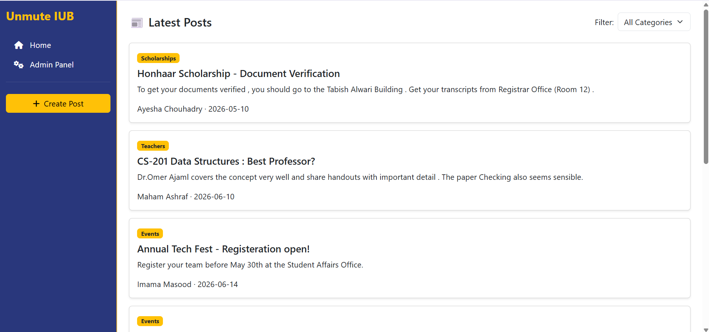
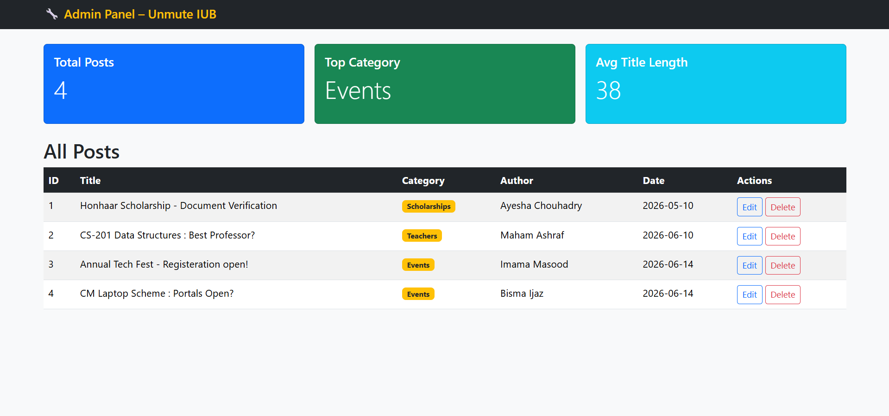

# Unmute IUB - Student Knowledge Sharing Platform

**Student Name:** Ayesha Chouhadry  
**Roll Number:** F24BDOCS1M01060

## Description
Unmute IUB is a student support web app for The Islamia University Bahawalpur. Students can share useful campus information about scholarships, teachers, assignments, events and notes.

The project has two panels:
- **User panel (`index.html`)** - view posts, search posts, filter by category, sort posts and create a new post.
- **Admin panel (`admin.html`)** - view all posts, edit posts, delete posts and see summary statistics.

## Tech Stack
- HTML5 semantic structure
- Bootstrap 5 for responsive layout and components
- Custom CSS for IUB blue/gold app-like UI
- Plain JavaScript only
- JSON Server as a mock REST API

## How to Install and Run
1. Open the project folder in terminal.
2. Run JSON Server:
   `npx json-server --watch db.json`
3. Open `index.html` in a browser.
4. Open `admin.html` or click **Admin Panel** from the user page.

## Features
- Fetch and display posts from JSON Server using GET
- Filter posts by category
- Debounced search bar for posts
- Sort posts by newest, oldest or title
- Create new posts using POST
- Form validation with required fields and minimum lengths
- Loading state and error state
- Admin table with all posts
- Edit posts using PUT
- Delete posts using DELETE with confirmation
- Three summary statistics on the admin panel
- Async/await with try/catch and response.ok checks
- Mobile responsive layout

## Screenshots

### User Panel

### Admin Panel

